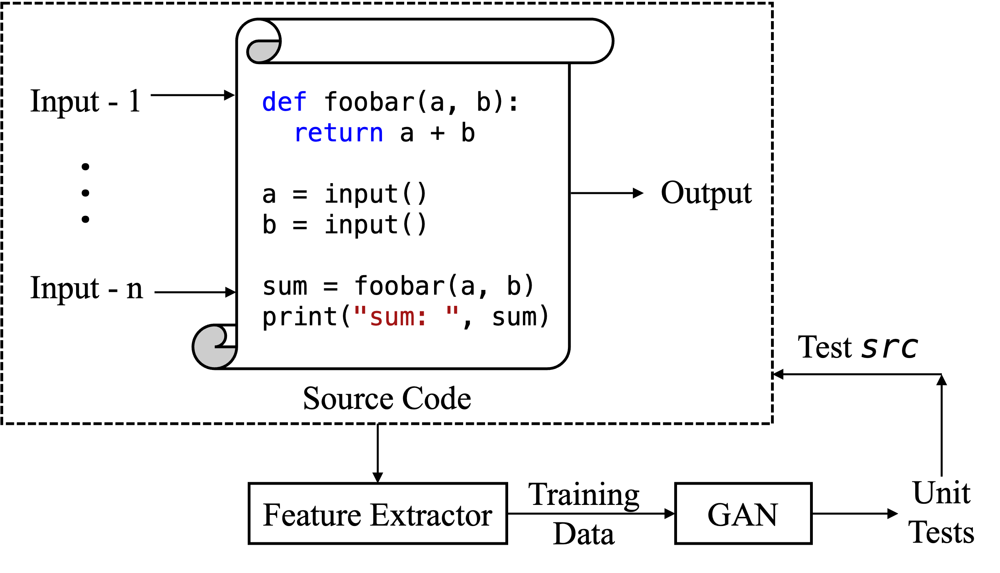

# TESTynamo

With the rapid digitization sweeping the lengths and breadths of modern-day industry, there has been an unprecedented need for bug-free software. However, with the increase in the sheer size and complexity of the codebase it has become more challenging than ever to fulfill the wants. Traditional software testing has outlived its glory. Manual testing in the 21<sup>st</sup> century is becoming antiquated. To cope with the exacting demands of the software industry, it is imperative that we embrace an automated approach to generate test suits and prevent bugs from entering production. Existing solutions tackle only a subset of problems such as branch coverage of a single program and are limited to a local environment. In this paper, I propose TESTynamo which leverages machine learning to generate comprehensive unit test cases for a broad spectrum of software systems. The key idea is to train GAN on the features of a code repository and generate unit test cases that not only cover as many branches as possible but also ensure that the full range of values including edges are covered. I implement TESTynamo locally using WGAN-GP and set up a CI/CD pipeline on AWS using Sagemaker to continually generate and test software before it is deployed. Performance analysis shows that my approach is feasible and scalable with a prototype version being able to generate a test suit on a simple program within 8 minutes while covering an impressive 90\% branches and 85\% of all possible values.

## Quick Start (Local module)

If you want to test out TESTynamo locally please navigate to the local folder and run the following command to generate test cases using the provided training data. You can modify the training data if needed.

```
python wgangp.py
```

The source code to be tested and its unit tests can be found at root of the repository. Testing can be done using coverage.py

## Quick Start (AWS module)

- Simply add your AWS SageMaker IAM role, Container Image URI, and S3 bucket location to train_mode.py, deploy_model.py, and generate_predictions.py.
- Push the code to your GitLab account to run the CI/CD pipeline
- Make changes to the repository and push the code to re-run the pipeline

## Architecture

Consult the high-level architecture of TESTynamo



## Key Contributions

- I propose a GAN-based approach that generates unit test cases such that the full range of all possible input combinations across all branches
- To the best of my knowledge, I am the first one to propose the integration of GAN-based unit test generation and testing in the CI/CD Pipeline
- As of this writing, many works are proposed in the literature but there is no publicly available code that the industry can use. I implement a prototype version of TESTynamo for local use. I also integrate it with a CI/CD pipeline hosted on GitLab and supported by AWS Sagemaker. My code is production-ready and can be readily adapted for use in the real world.
- I have documented the solutions to many common challenges in software testing, containerization, CI/CD, AI/ML and AWS including technical roadblocks and performance bottlenecks. This documentation can prove to be useful for anyone working with these technologies.

## Reference

For further reference please read my paper:
TESTynamo: An automated end-to-end CI/CD integrated GAN-powered unit test generator
<br>
[TESTynamo](https://assets.nandinibhatt.me/projects/testynamo/TESTynamo.pdf)

```
https://assets.nandinibhatt.me/projects/testynamo/TESTynamo.pdf
```
